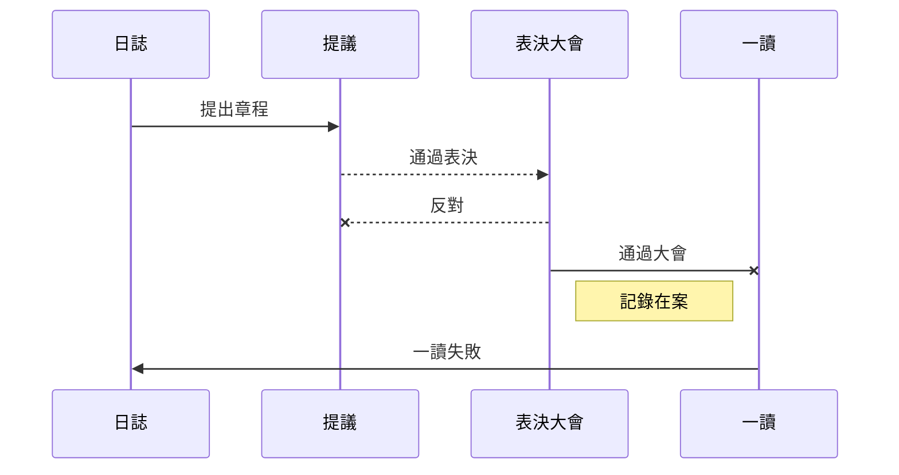
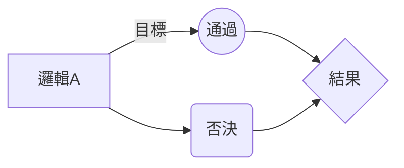

# 大粵民國憲志

## 大粵民國政府中央政策組黨派

### 廣東自民黨
#### 創立價值
我們自民黨所認為廣東民族主義是建構在廣東近代文化為基礎，加上理性主義與自由主義理念之上的公民民族主義。與其他以種族主義為基礎的族群民族主義（種族民族主義）不同，
我們強調廣東人應認同「廣東人」這個身份，這一身份不關乎血緣、祖先、文化及種族。
廣東民族主義之中，「民族」並非特指某一廣東族群（比如廣東廣府人、廣東潮汕人、廣東客家人、外省人等），而是指任何認同廣東文化、廣東價值的廣東公民所形成的的群體。因此，廣東民族主義倡導一種由廣府人、潮汕人、客家人、中華人民共和國成立後外省移民後代及所謂「新廣東人」等所有族群所共同擁有的民族身份。
	
### 暫定

### 創立價值

## 廣東自民黨
### 宗旨
- 本黨定名為廣東自民黨（英文： Liberal Democratic Party of Cantonia）以實現本黨之綱領為宗旨。
- 以推动广东省人民嘅公民意识为目的， 针对当今广东省内民生政策展开重新讨论。用 “自己友最心照” 为前提敢于幻想一条粤人治粤嘅平行时空路线。 
- 我们最终希望所有广东省各个城市嘅市民都可以对 ”公民意识“ 呢四个字再次认识，共同构建公民社会 
- 致力推动广东省内实行地方语言，地方音作为当地首要**行政语言**
- 致力推动广东省内以，广府话**粤语标准音**作为次要普通语言。推动 “我手写我口” 运动，以標準化後嘅粵語拼音，粤文，以及繁体字入宪。
- 推动官方地理位置重新定名，例如（不止于）
> 廣東英文名稱為 Cantonia  
> 廣州英文名稱為 Canton
- 本黨代表顏色為黃色及藍色。

### 黨員
#### 黨員之權利如下：
-   有依據本黨規章選舉、被選舉及罷免之權利。
-   在黨內會議有發言、提案及表決之權利。    
-   有接受本黨提名與支持之權利。    
-   對本黨有建議、檢舉及獲得資訊之權利。
-   對本黨之活動有參與之權利。    
-   對本黨提供之福利有享受之權利。

### 主张
#### 人权
- 法律面前人人平等
- 保障人身自由，任何人不受非法逮捕、拘禁、審問、處罰，並嚴謹刑求。
- 保障人民表達意見的自由，政府不得設置任何言論審查制度
- 保障人民結社的自由。
- 保障人民連結國際互聯網的自由
- 保障人民私密通訊的自由，禁止郵電管制、竊取、拆閱及非法監聽
- 保障人民宗教信仰自由，嚴禁迫害任何異教徒
- 尊重人犯的人格尊嚴，不得對人犯施加超出其應得懲罰之外的凌辱
- 尊重生命，嚴防冤獄，廢止死刑
- 禁止對政治犯及其家屬的一切歧視與迫害，並修改相關法律以保障政治犯的參政權及工作權。

#### 政治
- 反對任何形式的一黨專政與極權統治
- 政黨不得佔用公產，且不得投資或經營盈利事業。政黨以特權或不正當方式取得的財產，收歸國有
- 政黨退出軍、公安、安全保衛局、學校等單位
- 反對黑金政治、選舉賄賂
- 應賦予各級政府完整的人事權、立法權、組職權、財稅權等自治權限，以落實地方自治
- 保證人民私有財產，政府非因公共利益為目的，不得強制徵收人民財產，經徵收部分也應予以合理補償
- 肅清貪污，消除特權，公務人員不得擁有私人事業，建立公務人員財產登記制度
- 除擔任政府法人代表外，公職人員不得兼任公營事業以及其轉投資事業職務
- 公教人員應該維持行政中立，嚴禁利用其職權介入黨派之爭
- 提高公務人員行政效率，淘汰提高公務人員行政效率，淘汰冗員；人才晉用不受黨派、籍貫的限制。

#### 社会关怀
- 設立部會級的社會福利主管機關，推動全國性的社會福利事務；健全地方政府社會福利行政組織，推動地方性社會事務
- 規劃完整的社會保險、社會津貼與社會救助制度，保障人民基本生存條件
- 健全全民健康保險體系。提供國民便利的身體健康檢查制度暨高品質的醫療照顧，並使國人健康管理及醫療照護社區化
- 實施國民年金制度，逐步整合目前職業分立的老年退休保險體系，提供公平且具有所得重分配效果的國民年金，保障老人經濟安全
- 建立老人及身心障礙國民的長期照護制度，推行長期照護保險，並提供完整的社區化長期照護系統
- 保障身心障礙者教育、就業、經濟安全，以及充分參與社會的機會，逐步完成無障礙生活環境
- 興建公共住宅租予所得較低的居民，並藉此平抑房價，保障人民居住的權利
- 推動兩性平權政策，保障婦女的參政權、工作權及保障婦女人身安全
- 保障兒童、少年生存權利，廣設公立托兒所，提供高品質的托育服務，建立兒童、少年保護網絡，防止兒童、少年被虐待
- 縮小貧富差距，利用就業服務與所得移轉方案，提高低所得家戶的收入，並對低收入戶提供適足的社會救助
- 為平衡城鄉資源分配不均的現象，國家應主動投注較多資源於貧窮、落後地區的公共建設
- 確立國土永續利用原則，抑制土地投機，建立透明化的土地變更回饋機制
- 推動長期國家住宅政策，完善住屋市場交易機制，引導房價合理化，保障國民居住權利與品質
- 提昇政府現有國土計劃與管理專責單位層級，推動國土規劃與國土發展事務

#### 表

|                |未定                            |未定                         |
|----------------|-------------------------------|-----------------------------|
|未定             |未定                            |未定         
|未定             |`"未定"`                        |未定            
|Dashes          |`未定`                           | 未定 |

### 以下流程圖需要用到 Mermaid.js 做輔助渲染， 完整版需要用到 https://stackedit.io/app# 做可視化編輯。
#### 表決流程（測試中）

邏輯導圖
